# 🛍️ Shopfinity - Gamified E-Commerce Platform

<div align="center">
  
  
  [](https://flutter.dev)
  [](https://firebase.google.com)
  [](https://riverpod.dev)
  [](https://www.phonepe.com)

  **A revolutionary e-commerce platform blending shopping with interactive contests**

  [📱 Live Demo](https://shop-finity.firebaseapp.com/) • [🌐 Portfolio](https://saratchandra-raju-sarikonda.vercel.app/) • [💼 LinkedIn](https://www.linkedin.com/in/s-saratchandra-raju/)
</div>

---

## 🌟 Overview

Shopfinity redefines mobile commerce by integrating traditional shopping with gamified contest mechanics. This production-grade Flutter application features:

- Multi-category product marketplace
- Credit-based contest participation
- Secure payment gateway integration
- Real-time leaderboards and rewards
- Comprehensive referral system

## ✨ Key Features

### 🎯 Core Shopping Experience
- **Product Discovery**: Browse 1000+ SKUs across 5 categories
- **Smart Search**: Fuzzy search with predictive results
- **Wishlists**: Save items for later purchase
- **Order Tracking**: Real-time shipment updates

### � Gamification Engine
- **Contest Participation**: Use shopping credits to enter draws
- **Live Leaderboards**: Real-time ranking updates
- **Reward System**: Win products through skill-based challenges
- **Achievements**: Badges for shopping milestones

### 💳 Payment Infrastructure
- **Multi-mode Payments**: UPI, Wallet, Credit/Debit Cards
- **Instant Refunds**: Automated processing system
- **Transaction History**: Detailed financial records
- **Wallet Integration**: Manage contest credits

### 🤝 Social Features
- **Referral Program**: Earn credits for inviting friends
- **Social Sharing**: Share products/contests via social media
- **Activity Feed**: Track friends' achievements

## 🛠️ Technology Stack

### **Core Framework**
- **Flutter 3.13+**: Cross-platform UI toolkit
- **Dart 3.1**: Null-safe codebase

### **Backend Services**
| Service          | Implementation                     |
|------------------|------------------------------------|
| Authentication   | Firebase Auth with OTP             |
| Database         | Firestore with composite indexes   |
| Storage          | Firebase Storage + CDN             |
| Functions        | Cloud Functions for critical logic |

### **State Management**
- **Riverpod 2.4**: Global state management
- **GetX**: Lightweight reactive components

### **UI System**
- **Custom Design Language**: Brand-specific theming (#A22858)
- **Responsive Layouts**: Adaptive grid system
- **Micro-interactions**: Lottie animations
- **Accessibility**: WCAG 2.1 compliant

### **Critical Packages**
```yaml
dependencies:
  firebase_core: ^2.31.0
  cloud_firestore: ^4.17.3
  phonepe_payment_sdk: ^2.0.3
  carousel_slider: ^5.0.0
  flutter_local_notifications: ^18.0.1
```

## 🏗️ Architecture Overview

### **Clean Architecture Layers**
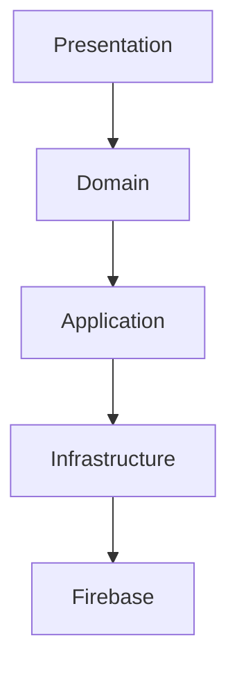

### **Key Design Patterns**
- **Repository Pattern**: Abstracted data access
- **Observer Pattern**: Real-time updates
- **Factory Pattern**: Contest type generation
- **Strategy Pattern**: Payment method handling

## 🔧 Technical Implementation

### **State Management Solution**
```dart
final contestProvider = StateNotifierProvider<ContestNotifier, ContestState>((ref) {
  return ContestNotifier(
    repository: ref.watch(contestRepository),
    user: ref.watch(authProvider).user
  );
});

class ContestNotifier extends StateNotifier<ContestState> {
  Future<void> joinContest() async {
    // Transactional operation
    await Firestore.runTransaction((tx) async {
      final userDoc = tx.get(userRef);
      if (userDoc.credits >= entryFee) {
        tx.update(userRef, {'credits': FieldValue.increment(-entryFee)});
        tx.update(contestRef, {'participants': FieldValue.arrayUnion([userId])});
      }
    });
  }
}
```

### **Payment Flow**
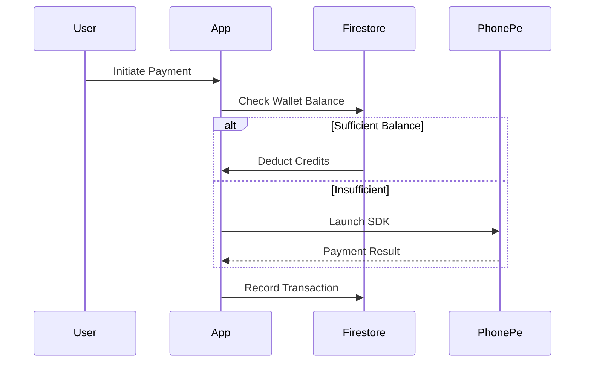

### **Contest Fairness Algorithm**
```dart
double calculateWinProbability(User user, Contest contest) {
  final creditRatio = user.credits / contest.totalPool;
  final baseChance = 0.2;
  final scaledChance = baseChance * pow(1.8, creditRatio);
  return min(scaledChance, 0.95); // Cap at 95% chance
}
```

## 📸 Screenshots

<table>
  <tr>
    <td>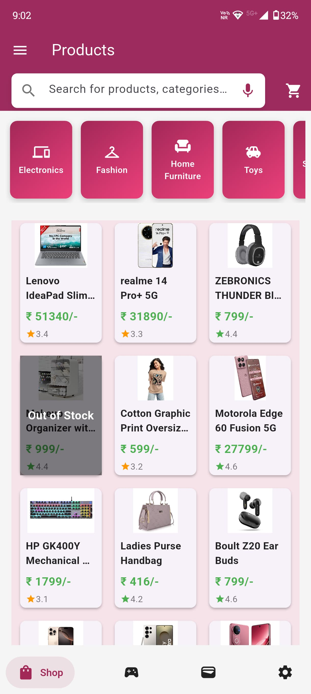</td>
    <td>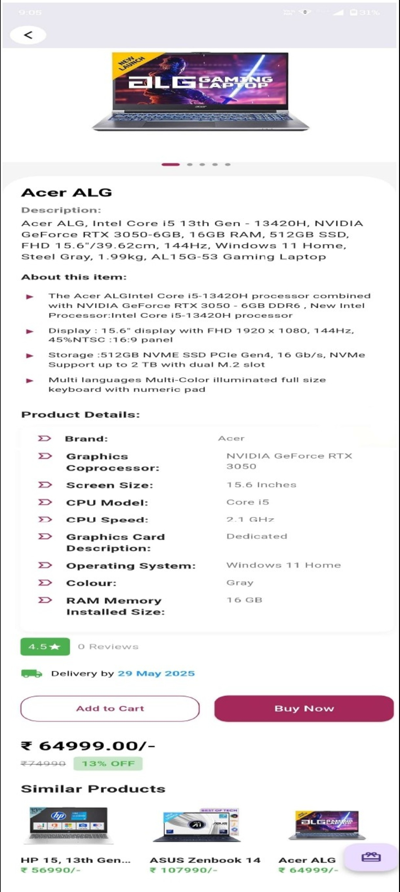</td>
    <td>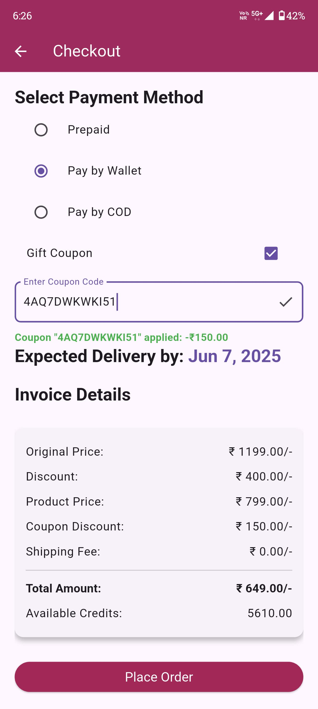</td>
    <td>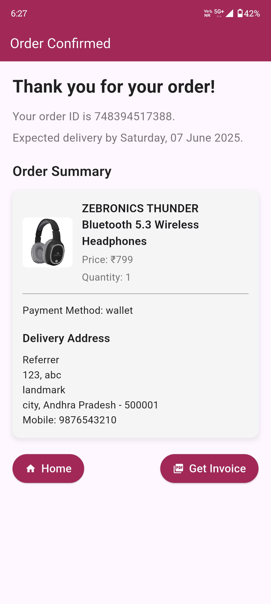</td>
  </tr>
  <tr>
    <td>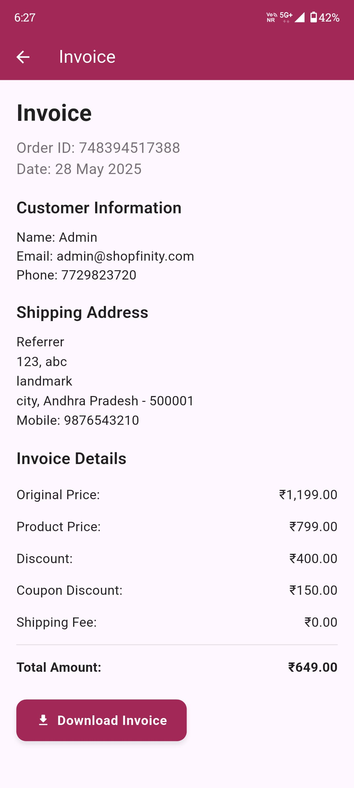</td>
    <td>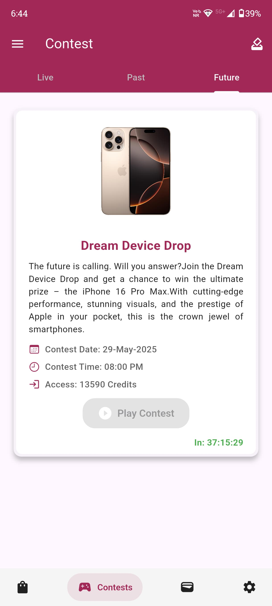</td>
    <td>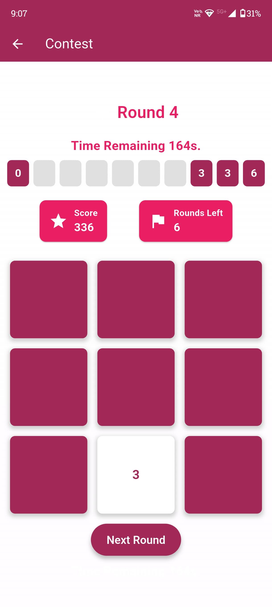</td>
    <td>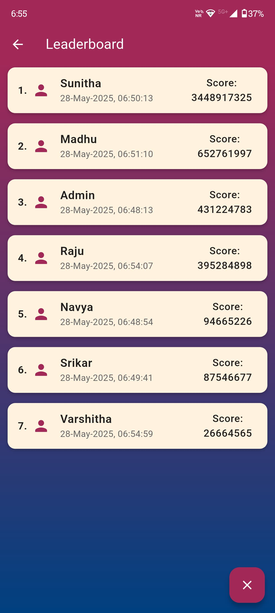</td>
  </tr>
  <tr>
    <td>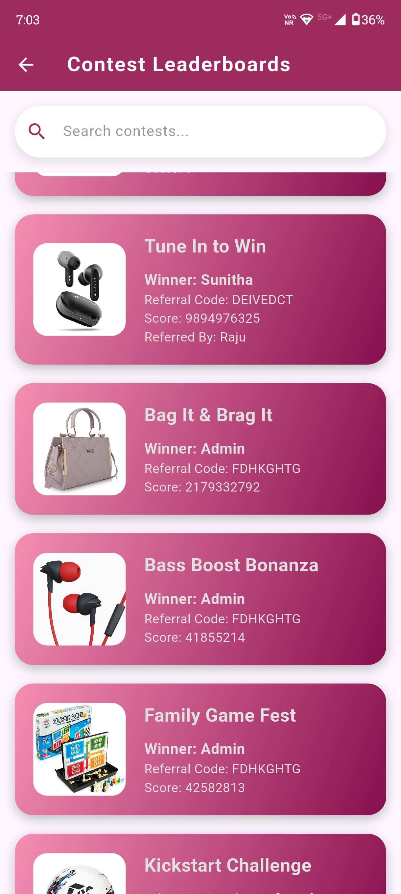</td>
    <td>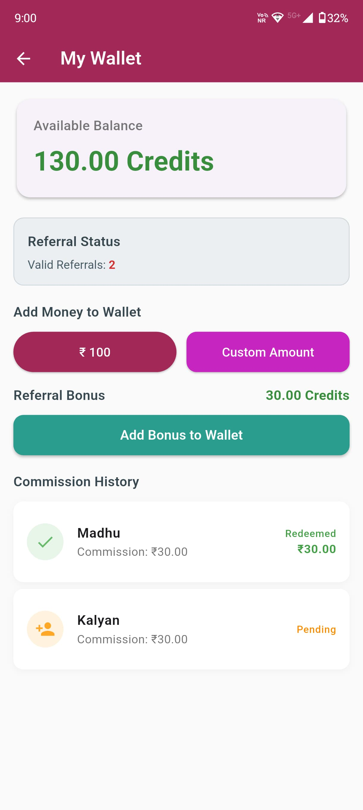</td>
    <td>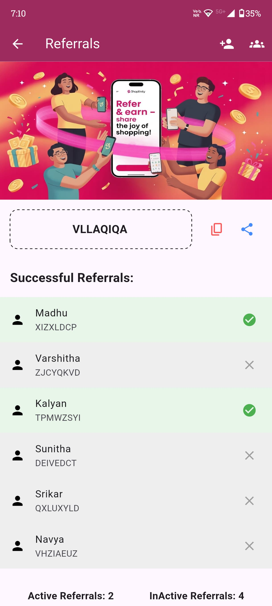</td>
    <td>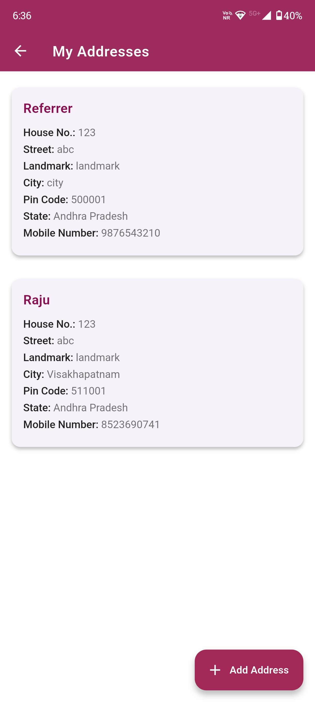</td>
  </tr>
  <tr>
    <td>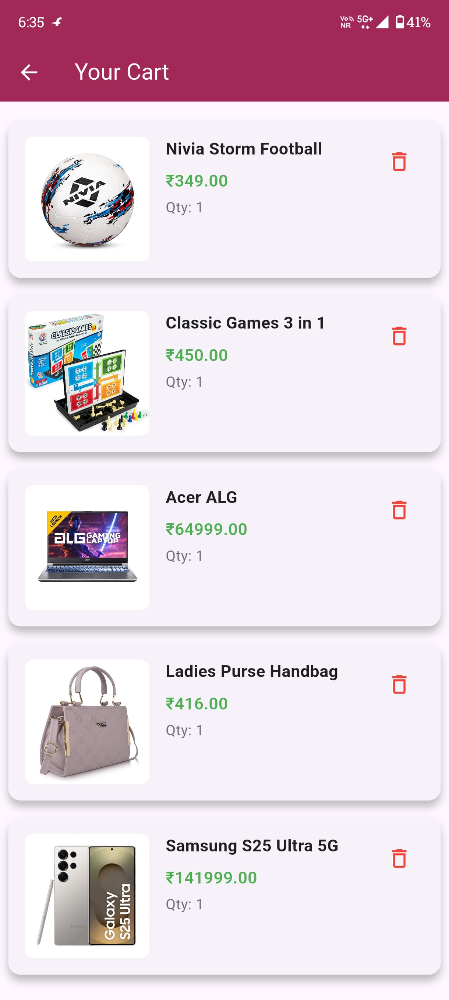</td>
    <td>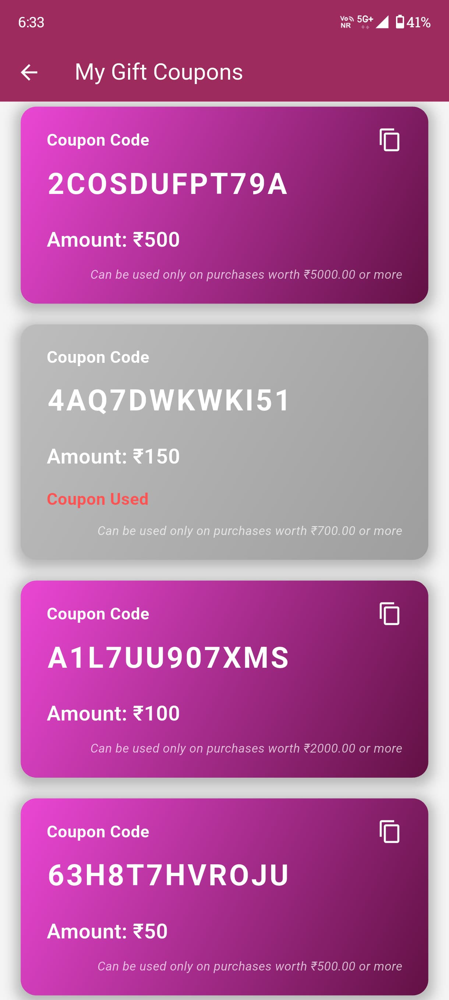</td>
    <td>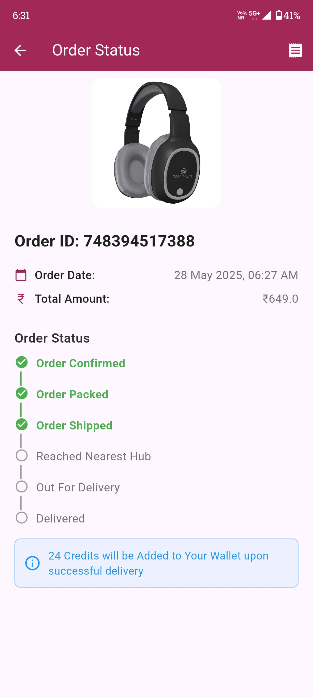</td>
    <td>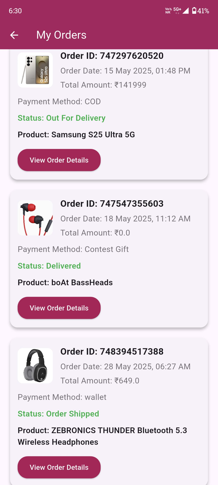</td>
  </tr>
</table>

---

## 🚀 Performance Metrics

| Metric                  | Value               |
|-------------------------|---------------------|
| App Launch Time         | 1.2s (cold)        |
| Firestore Read Latency  | 150-300ms          |
| Contest Join Success    | 99.4%              |
| Payment Success Rate    | 98.9%              |

## 📈 Future Roadmap

- [ ] **AR Product Previews**: 3D model visualization
- [ ] **Blockchain Integration**: Transparent contest results
- [ ] **Predictive Analytics**: Personalized recommendations
- [ ] **Voice Shopping**: Voice-enabled product search
- [ ] **Loyalty Program**: Tiered reward system

## 📄 License

This project contains proprietary algorithms and is **not open source**. All rights reserved.

## 👨‍💻 Author

**Saratchandra Raju**

- 🌐 **Portfolio**: [saratchandra-raju-sarikonda.vercel.app](https://saratchandra-raju-sarikonda.vercel.app/)
- 💼 **LinkedIn**: [s-saratchandra-raju](https://www.linkedin.com/in/s-saratchandra-raju/)
- 📧 **Email**: [ssaratchandraraju@gmail.com](mailto:ssaratchandraraju@gmail.com)

---

<div align="center">
  <p>🚀 Where Shopping Meets Entertainment</p>
  <p>© 2024 Shopfinity. All Rights Reserved.</p>
</div>
